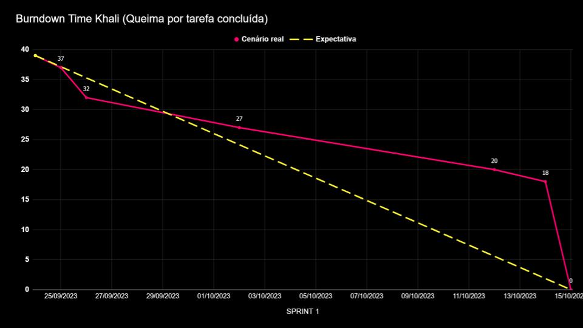
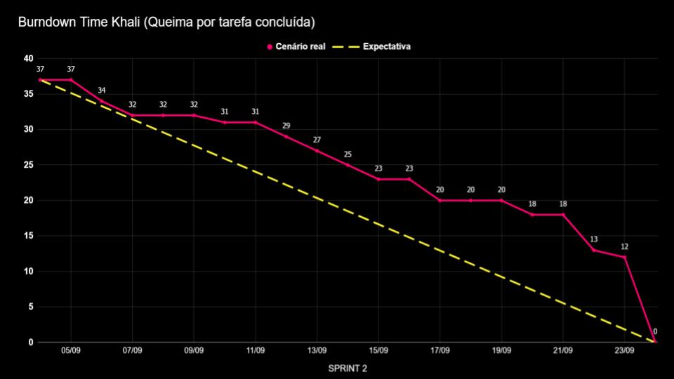
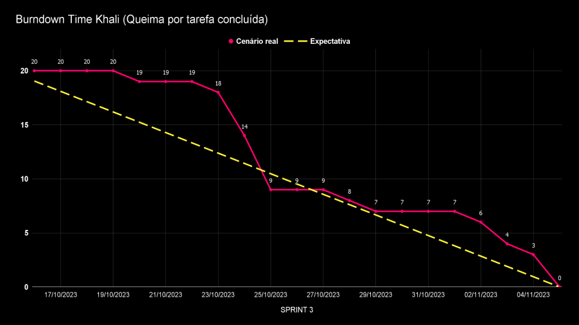

# Ferramenta para controle de Horas Extras e Sobreavisos

Sistema que faça o controle da jornada de trabalho do colaborador, identifique e classifique horas extras e sobreavisos.

Acesso de administrador (master para os departamentos pessoal e financeiro), gestor (aprovação e lançamento) e colaborador (apontar horas extras).

 

    
    
    
    

  

### Detalhes e conhecimentos exigidos no projeto:

* Implementar Aplicação usando Linguagem de Programação (LP) Java Web para BackEnd;
* Implementar Aplicação usando conceitos de Orientação a Objetos (OO);
* Utilizar IDE´s na implementação de Aplicação em Java;
* Aplicar Técnicas de Depuração e Análise de Logs através da IDE com suporte para a LP Java;
* Implementar web services REST;
* Implementar clientes para consumir web services;
* Implementar projeto de Banco de Dados Relacional em termos de seus Principais Objetos (Schema, Tabelas, Views, Índices);
* Implementar consultas em um Banco de Dados Relacional, utilizando junções, subconsultas e agrupamentos;
* Implementar manutenção de dados utilizando DML.

### Artefatos:

 Requisitos do projeto 

<h2 align="center">Requisitos Funcionais</h2>

* Usuários devem ter perfis diferentes: administrador (acesso as informações de
parametrização, extração de relatórios e aprovação), gestor (aprovação e lançamento) e
colaborador (apontar horas);
* Apontamento de horas extras e classificação das horas;
* Apontamento de horas de sobreaviso;
* No lançamento da hora extra especificar cliente, CR (centro de resultado), projeto,
solicitante e justificativa;
* Cadastro de clientes e CRs;
* Workflow para aprovação de horas extras executadas;
* Parametrização de sistema (período de fechamento das horas, percentual de classificação
das horas extras (75% e 100%, conforme material de apoio) e adicional noturno
juntamente com as verbas salariais, definição dos horários de início e fim de horas
noturnas);
* Extração de relatório csv de todos os colaboradores com as horas trabalhadas (matrícula,
nome, verba, quantidade de horas, cliente, CR, projeto, justificativa);
* Aplicar regras de horas extras e sobreavisos na extração (classificação de HEs e cálculo do
sobreaviso considerando as HEs conflitantes);
* Notificação de lançamentos realizados para Gestor e RH;
* Dashboard com acompanhamento em tempo real das horas extras executadas com filtro
cliente, CR e colaborador.

 
<h2 align="center">Requisitos Não Funcionais</h2>

* Usabilidade (na facilidade de uso e na facilidade de aprendizado)
* Manutenibilidade (código passível de evolução e reparos)
    * Exemplo, na mudança de cores as telas sejam adaptativas a este requisito
* Desempenho
* Reusabilidade
* Segurança
* logins [oAuth, keyclock, por exemplo]
    * Autorização do acesso a informação (perfis de login)
    * Tráfego de dados através de endpoints com token que expiram
    * Se exportação de arquivo CSV, validação com processos de CheckSum

 

 Product Backlog 

<h2 align="center"> Product Backlog Khali </h2>

| Rank | Prioridade |  Story  | Críterios de aceite | Sprint|
|:-----|:-----------|:--------|:--------------------|:------|
| 1 | 1 | Como colaborador preciso ser capaz de apontar as minhas horas extras e sobreavisos no sistema para que elas fiquem registradas. | Ser capaz de inserir apontamentos de sobreaviso; Ser capaz de inserir apontamentos de horas extras. | 1 |
| 2 | 2 | Como colaborador preciso ter acesso ao estado dos meus apontamentos de hora extra e sobreaviso para me manter atualizado.  | Visualizar status dos apontamentos; Visualizar histórico de apontamentos. | 1 |
| 3 | 3 | Como gestor preciso ser capaz de consultar o histórico de apontamentos da(s) minha(s) squad(s) para facilitar o controle de horas extras e sobreavisos feitos pela minha squad. | Consulta de apontamentos por squad; Consulta de apontamentos por colaborador; Consulta de apontamentos por data | 1 |
| 4 | 4 | Como administrador preciso ser capaz de cadastrar colaboradores, gestores e administradores para que eu possa designá-los as permissões corretas no sistema. | Inserir novo usuário do tipo Colaborador; Inserir novo usuário do tipo Gestor; Inserir novo usuário do tipo Administrador. | 1 |
| 5 | 5 | Como administrador preciso ser capaz de cadastrar clientes e seus respectivos projetos para que sejam referenciados durante o apontamento de horas extras e sobreavisos.  | Inserir novo cliente que possa ser associado em novos apontamentos; Inserir novo projeto que possa ser associado em novos apontamentos | 2 |
| 6 | 6 | Como administrador preciso ser capaz de cadastrar squads para que os apontamentos sejam corretamente associados aos Centros de Resultado. | Inserir uma nova Squad. | 1 |
| 7 | 7 | Como administrador preciso ter acesso aos apontamentos de hora extra e sobreaviso de cada squad dos meus gestores para melhor acompanhamento do período trabalhado dos meus colaboradores. |Visualizar todos os apontamentos lançados de todos os colaboradores. | 1 |
| 8 | 1 | Como gestor preciso ser capaz de aprovar ou rejeitar os apontamentos de hora extra e sobreaviso dos colaboradores da(s) minha(s) squad(s) para barrar apontamentos inválidos.  | Ser capaz de Aprovar ou Reprovar um apontamento. | 2 |
| 9 | 2 | Como gestor preciso dar um feedback para apontamentos recusado por mim para que o solicitante tenha uma justificativa de o porquê da recusa.  | Ser capaz de inserir uma justificativa no caso de apontamentos reprovados | 2 |
| 10| 3 | Como administrador preciso ser capaz de configurar os parâmetros da verba dos apontamentos para ter melhor controle sobre as horas trabalhadas dos colaboradores.  | Ser capaz de alterar a duração da verba; Ser capaz de alterar o código da verba; Ser capaz de alterar a porcentagem do valor da hora. | 2 |
| 11 | 4 | Eu como administrador preciso poder desativar um colaborador no caso de uma desistência.  | Não ter mais visualização dos apontamentos dos usuários do tipo; Usuários desativados deixam de realizam apontamentos | 2 |
| 12 | 1 | Como administrador preciso ser capaz de gerar relatórios CSV contendo as horas trabalhadas dos meus colaboradores para poder integrar com outras ferramentas de análise, pela portabilidade, compartilhamento fácil e baixo custo de processamento. | Ser capaz de extrair um relatório com todos os apontamentos num arquivo “.csv” ;No relatório, ser capaz de escolher quais informações vão ser extraídas | 3 |
| 13 | 2 | Como gestor, quero receber notificações quando um apontamento de um membro da minha(s) squad(s) for lançado para agilizar o meu processo de validação. | O gestor deve receber uma notificação quando um apontamento de um membro da sua squad for lançado ;O gestor deve poder ter acesso direto ao apontamento lançado através da notificação. | 3 |
| 14 | 3 | Como colaborador, quero receber notificações quando meu gestor aprovar ou rejeitar meus apontamentos de horas extras e sobreaviso, para que eu fique atualizado sobre o status. | O colaborador deve receber notificações quando um apontamento for avaliado ;O colaborador através da mensagem deve poder ter acesso direto ao apontamento em questão | 3 |
| 15 | 4 | Eu como colaborador preciso poder editar um apontamento anteriormente reprovado para uma nova avaliação. | Alterar informação do apontamento que foi reprovado e lançá-lo novamente para aprovação do gestor. | 3 |
| 16 | 1 | Como administrador preciso ter acesso a um Dashboard com informações da jornada de trabalho de todos os meus colaboradores para ter controle sobre os apontamentos lançados, quais são os clientes com mais horas, quais squads fazem mais horas e afins. | Exibição de horas trabalhadas de todas as squads e comparação por squads; Exibição de horas trabalhadas de todos os colaboradores e comparação por colaboradores | 4 |
| 17 | 2 | Como gestor preciso ter acesso a um Dashboard com informações da minha jornada de trabalho e de todos os colaboradores da(s) minha(s) squad(s) para melhor visualização e tratamento dos dados. | Exibição de horas trabalhadas de todas as squads e comparação por squads; Exibição de horas trabalhadas de todos os colaboradores e comparação por colaboradores; Exibição de horas trabalhadas; feedback do gestor dos apontamento avaliados | 4 |
| 18 | 3 | Como um colaborador, desejo acessar um Dashboard que me forneça informações claras sobre as horas trabalhadas e metas alcançadas para que eu possa visualizar e analisar meus dados de trabalho de forma eficaz | Exibição de horas trabalhadas; Atualização em tempo real; Feedback do gestor | 4 |
| 19 | 4 | Eu como colaborador preciso poder redefinir minha senha para almentar a segurança da minha conta em caso de perca ou esquecimento. | poder redefinir minha senha com acesso ao sistema; poder redifinir minha senha sem acesso ao sistema | 4 |

 

 Backlog das Entregas 

<h2>Sprint 1</h2>

|  Entregas  | Story |
|:---------|:----------------------|
| Fluxograma. | Planejamento - Não há story relacionada |
| Wireframe. | Planejamento - Não há story relacionada |
| ERD. | Planejamento - Não há story relacionada |
| Banco de Dados estruturado. | Planejamento - Não há story relacionada |
| Criação do sistema de apontamento de horas extras e sobreavisos. | Como colaborador preciso ser capaz de apontar as minhas horas extras e sobreavisos no sistema para que elas fiquem registradas. |
| Listagem de apontamentos de horas extras e sobreavisos. | Como colaborador preciso ter acesso ao estado dos meus apontamentos de hora extra e sobreaviso para me manter atualizado; Como gestor preciso ser capaz de consultar o histórico de apontamentos da(s) minha(s) squad(s) para facilitar o controle de horas extras e sobreavisos feitos pela minha squad; Como administrador preciso ter acesso aos apontamentos de hora extra e sobreaviso de cada squad dos meus gestores para melhor acompanhamento do período trabalhado dos meus colaboradores. |
| Sistema de cadastro de colaboradores, gestores e administradores. | Como administrador preciso ser capaz de cadastrar colaboradores, gestores e administradores para que eu possa designá-los as permissões corretas no sistema. |

<h2>Sprint 2</h2>

|  Entregas  | Story |
|:---------|:----------------------|
| Validação de apontamentos pelo gestor. | Como gestor preciso ser capaz de aprovar ou rejeitar os apontamentos de hora extra e sobreaviso dos colaboradores da(s) minha(s) squad(s) para barrar apontamentos inválidos. |
| Funcionalidade de feedback do gestor ao rejeitar um apontamento. | Como gestor preciso dar um feedback para apontamentos recusado por mim para que o solicitante tenha uma justificativa de o porquê da recusa. |
| Sistema de cadastro de squads. | Como administrador preciso ser capaz de cadastrar squads para que os apontamentos sejam corretamente associados aos Centros de Resultado. |
| Sistema de cadastro de clientes e projetos. | Como administrador preciso ser capaz de cadastrar clientes e seus respectivos projetos para que sejam referenciados durante o apontamento de horas extras e sobreavisos. |
| Desativação de usuário. | Eu como administrador preciso poder desativar um colaborador no caso de uma desistência. |
| Visualização de usuários desativados. | Eu como administrador preciso ter acesso a um histórico de colaboradores que foram desativados. |
| Funcionalidade de adição e parametrização de verbas do sistema. | Como administrador preciso ser capaz de configurar os parâmetros da verba dos apontamentos para ter melhor controle sobre as horas trabalhadas dos colaboradores |

<h2>Sprint 3</h2>

|  Entregas  | Story |
|:---------|:----------------------|
| Extração de relatório | Como administrador preciso ser capaz de gerar relatórios CSV contendo as horas trabalhadas dos meus colaboradores para poder integrar com outras ferramentas de análise, pela portabilidade, compartilhamento fácil e baixo custo de processamento. |
| Notificações | Como gestor, quero receber notificações quando um apontamento de um membro da minha(s) squad(s) for lançado para agilizar o meu processo de validação. |
| Notificações | Como colaborador, quero receber notificações quando meu gestor aprovar ou rejeitar meus apontamentos de horas extras e sobreaviso, para que eu fique atualizado sobre o status. |
| Alteração de senha | Eu como colaborador preciso alterar minha senha sempre que necessário |
| UX | -- Não há story relacionada -- |

<h2>Sprint 4</h2>

|  Entregas  | Story |
|:---------|:----------------------|
| Dashboard Adm | Como administrador preciso ter acesso a um Dashboard com informações da jornada de trabalho de todos os meus colaboradores para ter controle sobre os apontamentos lançados, quais são os clientes com mais horas, quais squads fazem mais horas e afins. |
| Dashboard Gestor | Como gestor preciso ter acesso a um Dashboard com informações da minha jornada de trabalho e de todos os colaboradores da(s) minha(s) squad(s) para melhor visualização e tratamento dos dados. |
| Dashboard Colaborador | Como um colaborador, desejo acessar um Dashboard que me forneça informações claras sobre as horas trabalhadas e metas alcançadas para que eu possa visualizar e analisar meus dados de trabalho de forma eficaz. |

 Burndown 

 

### Tríade da API
Linguagem de programação II, Progamação em Banco de dados e Laboratório de desenvolvimento de Banco de Dados III.

### Prazos

* [X] 04/09 a 24/09 - Sprint 1
* [X] 25/09 a 15/10 - Sprint 2
* [X] 16/10 a 05/11 - Sprint 3
* [X] 06/11 a 26/11 - Sprint 4

 
 

### Arquitetura e Tecnologias

Este repositório contém tanto o [Back-End](./api/) quanto o [Front-End](./web/) do desafio proposto pela FATEC em parceria com a empresa parceira.

#### Back-End `./api/`
>* [Java]().
>* [Spring](https://spring.io/).
>* [Docker](https://www.docker.com/) com [Docker Compose](https://docs.docker.com/compose/).
>* [PostgreSQL](https://www.postgresql.org/) banco de dados escolhido.
 

#### Front-End `./web/`
> * [React](https://react.dev/).
> * [Typescript](https://www.typescriptlang.org).
 

<h2 align="center"> Estrutura e documentação </h2>
 

> [Wireframe completo no Figma](https://www.figma.com/file/0CRUGDxQoOc3QRMK16TyHa/Untitled?type=design&mode=design&t=ukkR699csvDlWLYY-1)

> [ERD](https://github.com/projetoKhali/api3/blob/be27d7c6c37234c0423714cce698620c3f090968/Docs/Banners/ERD.PNG)

> [Diagrama de Entidade-Relacionamento](https://github.com/projetoKhali/api3/blob/be27d7c6c37234c0423714cce698620c3f090968/Docs/Banners/Entidade-Relacionamento.png)

> [Documentação banco de dados](https://github.com/projetoKhali/api3/blob/be27d7c6c37234c0423714cce698620c3f090968/Docs/Banners/Documenta%C3%A7%C3%A3o%20BD.pdf)

 
